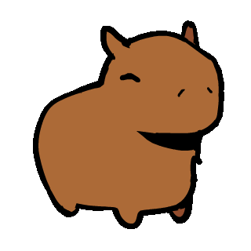

  

  
  
  
  

## 🤙 Hey there! How's it going?

I'm **Yago Santos**, a **Jr. Full Stack Developer** and **Computer Science** student passionate about creating solutions that make a difference!

I work on corporate projects and as a freelancer, always seeking to transform ideas into functional code. I love working with modern technologies and I'm constantly exploring the dev world!

## 🛠️ Tech Stack & Skills

  

  <picture>
    <source media="(prefers-color-scheme: dark)" srcset="https://raw.githubusercontent.com/yagoprssantos/yagoprssantos/output/github-snake-dark.svg" />
    <source media="(prefers-color-scheme: light)" srcset="https://raw.githubusercontent.com/yagoprssantos/yagoprssantos/output/github-snake.svg" />
    
  </picture>

